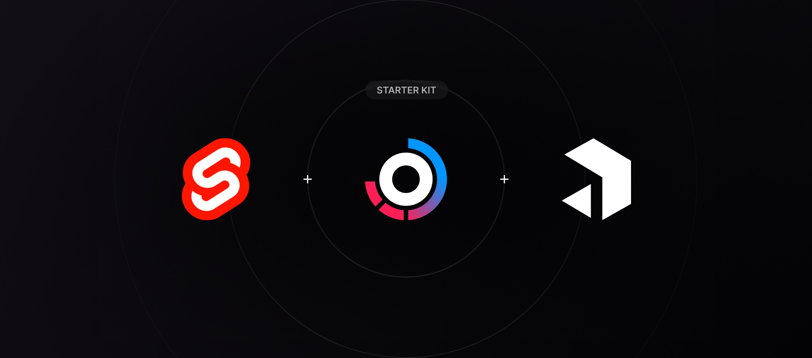

# SvelteKit + Payload CMS + TurboRepo Starter

This project is a TurboRepo managed by pnpm. It contains several packages and applications, each serving a specific purpose.

## Packages

### eslint-config

This package contains the ESLint configuration used across the monorepo. More details can be found in the.

### payload-config

Includes the generated Payload CMS types by running `pnpm generate:payload-types` in the `apps/cms` directory. Includes also the GraphQL schema generated by running `pnpm generate:graphQLSchema` in the `apps/cms` directory.

### typescript-config

This package contains the TypeScript configuration used across the monorepo. More details can be found in the.

### ui

This package contains shared UI components. Could maybe be removed in the future. Not sure if it's needed.

### tailwind-config

This package contains the Tailwind CSS configuration used across the monorepo. More details can be found in the.

## Apps

### cms

This is a Payload CMS application. It's responsible for content management.

> Payload CMS can't handle barrel files. Just import the files directly.

### web

This is a SvelteKit application. It's responsible for the website and already is a fully functional SSR application.

#### features

- [x] Tailwind CSS
- [x] Types generated from GraphQL schema and Payload CMS types
- [x] GraphQL client
- [x] SSR
- [ ] Various standard pages (about, contact, etc.)
- [ ] Error pages
- [ ] Localization
- [ ] Fully functional blog with categories
- [ ] Projects page with projects from Payload CMS
- [ ] SEO
- [ ] Sitemap
- [ ] RSS feed
- [ ] Cookie consent

## Notes

(Add your notes here)

## Getting Started

To get started with development, run the following command:

```sh
pnpm dev
```

This will start the SvelteKit application and the Payload CMS application.

## Deployment

(Add your deployment instructions here)

## Milestones

The Starter should be good already for the most boilerplate stuff. The following list is a rough roadmap for the next steps. Feel free to add your own ideas.

- [x] Setup SvelteKit
- [x] Setup Tailwind CSS
- [x] Setup Payload CMS
- [x] Setup GraphQL
- [ ] Build a landing page
- [ ] Build a blog
- [ ] Make it seedable
- [ ] Make it deployable
- [ ] Create a demo example page
